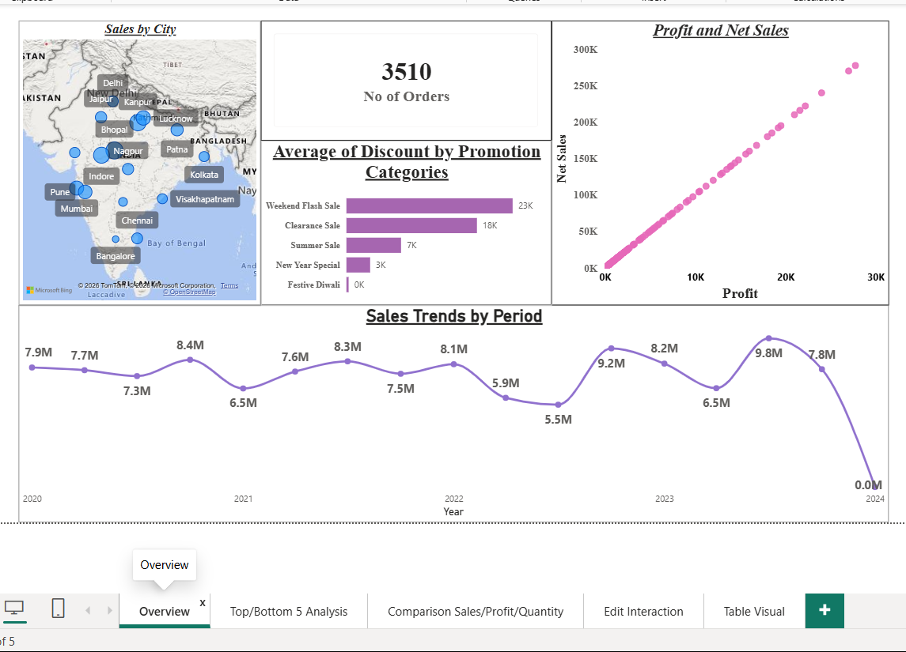
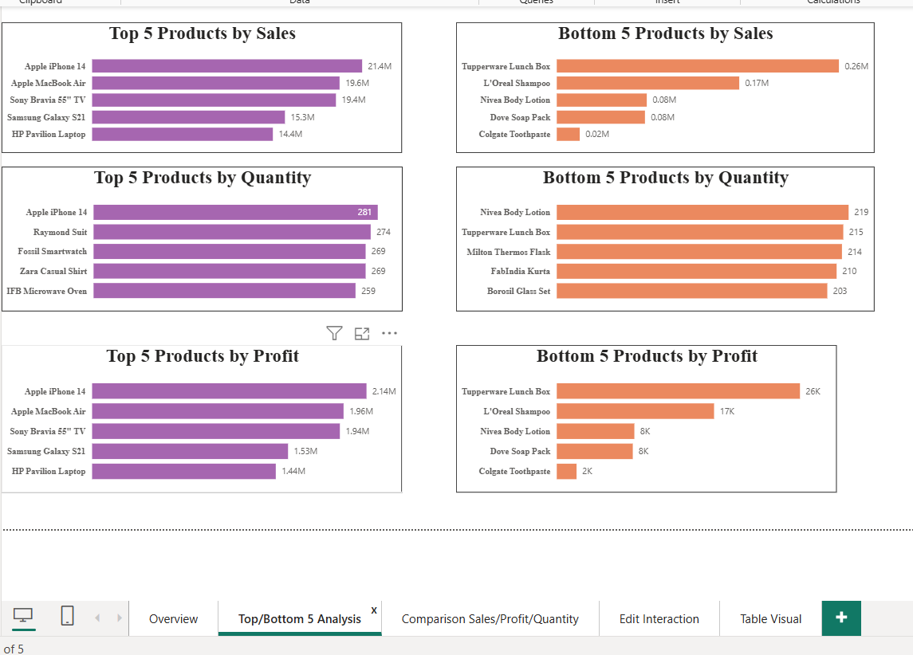
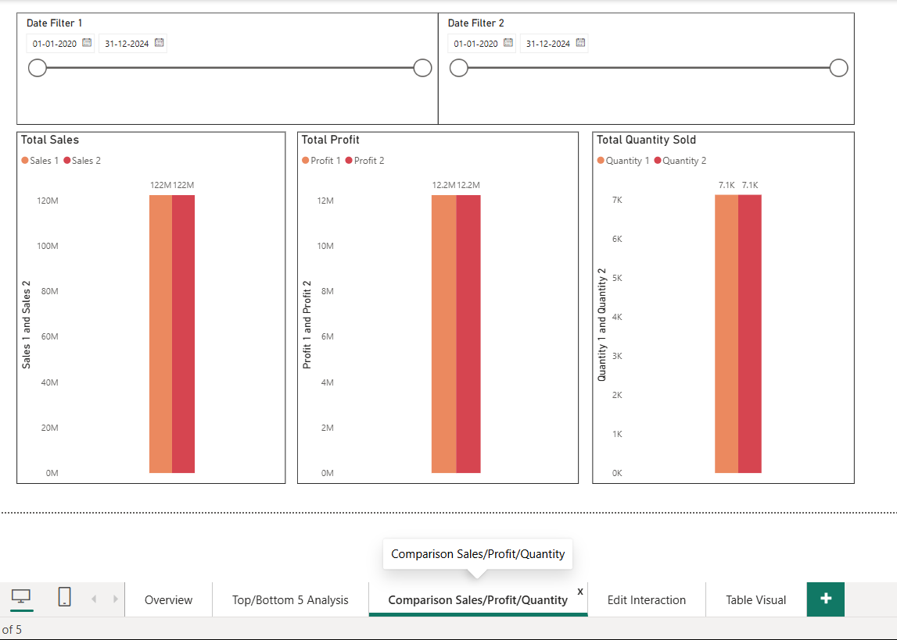
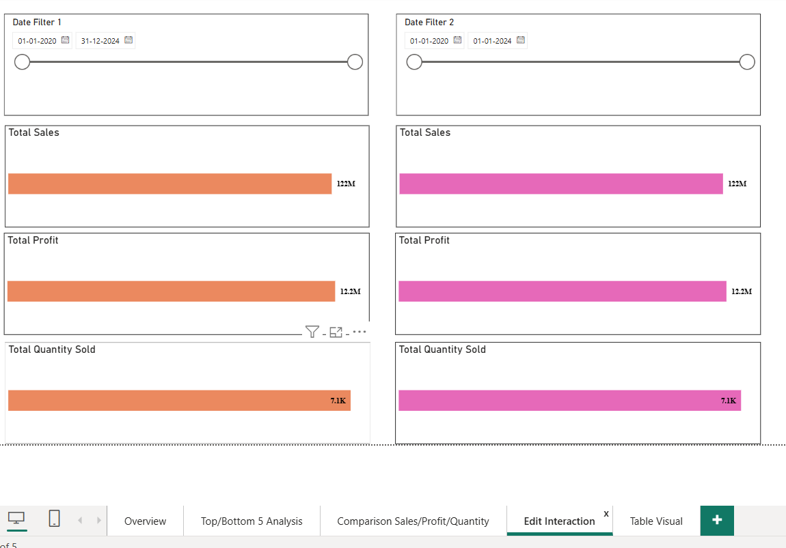
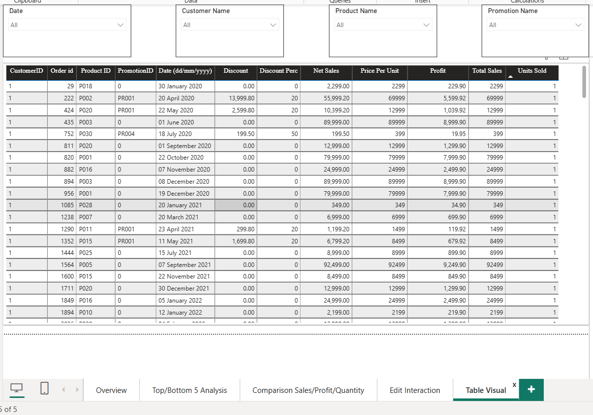

# 📊 ElectroHub Sales & Profitability Analytics Dashboard


An interactive Power BI dashboard that analyzes ElectroHub's sales performance and customer purchasing behavior across product categories, cities, and promotions — helping stakeholders spot top/bottom performers, margin drains, and regional sales variances at a glance.

---

## 🧩 Problem Statement

ElectroHub needed a single view to understand:
- Which products drive the most **sales** vs. the most **profit** (and where the two diverge)
- How performance shifts across **daily, monthly, quarterly, and annual** timeframes
- Whether **discounts** by promotion category are driving profitable volume or eroding margins
- How sales vary **geographically** across cities
- Full **order-level transparency** for audits and operational drill-downs

This dashboard consolidates all of that into one filterable Power BI report.

---

## 🖼️ Dashboard Preview

| | |
|---|---|
|  |  |
|  |  |



---

## 🎯 Key Insights & Actions

| Focus Area | Insight | Recommended Action |
|---|---|---|
| **Product & Profitability** | Bottom 5 products by profit reveal low-margin/negative-yield items | Re-evaluate pricing, discounting, or supply chain costs |
| **Sales vs. Profit Correlation** | Some categories show high sales but weak profit conversion | Investigate production/promotional cost structure |
| **Geographic Performance** | Sales vary significantly across cities | Reallocate marketing spend to underperforming hubs |
| **Promotion Efficiency** | High average discounts in some promo categories may not convert to profit | Audit discount ROI by promotion category |
| **Operational Control** | Order-level data is filterable by Product, Date, Customer ID, Promotion | Use for fulfillment tracking and targeted campaigns |

---

## 🏗️ Data Model

The report uses a **star schema**:

- **Fact Table** — transactional sales data: Net Sales, Profit, Units Sold, Date, Discount, Customer ID, Product ID, Promo ID
- **Dim Customers** — customer attributes
- **Dim Product** — product name, category
- **Dim Promotion** — promotion category, discount details
- **Date Table 1 / Date Table 2** — two date dimensions, connected via `USERELATIONSHIP` for flexible period-over-period comparisons

All dimension tables connect to the fact table via **1-to-many relationships**.

---

## 🧮 Key DAX Measures

```DAX
Sum of Net Sales = 
CALCULATE(
    SUM('Fact Table'[Net Sales]), 
    ALL('Date Table 1'), 
    USERELATIONSHIP('Date Table 2'[Date], 'Fact Table'[Date (dd/mm/yyyy)])
)
```

```DAX
Total Profit = 
CALCULATE(
    SUM('Fact Table'[Profit]),
    ALL('Date Table 1'),
    USERELATIONSHIP('Date Table 2'[Date], 'Fact Table'[Date (dd/mm/yyyy)])
)
```

```DAX
Total Quantity = 
CALCULATE(
    SUM('Fact Table'[Units Sold]),
    ALL('Date Table 1'),
    USERELATIONSHIP('Date Table 2'[Date], 'Fact Table'[Date (dd/mm/yyyy)])
)
```

---

## 📈 Dashboard Features

- **KPI Cards** — Total Net Sales, Total Profit, Total Quantity Sold, Average Discount
- **Top 5 / Bottom 5 Products by Profit** — Clustered bar chart with Top N visual-level filter
- **Net Sales vs. Profit Scatter Plot** — Segmented by Product Category
- **Order-Level Detail Table** — Full audit trail with Net Sales, Discounts, and Order Volume
- **Slicers** — Product Category, City, Promotion Category, Order Date
- **Period-over-Period Comparison** — Dynamic benchmarking between any two timeframes

---

## 🛠️ Tools & Techniques Used

- **Power BI Desktop** (Power Query, Data Modeling, DAX, Report Design)
- Star schema modeling with dual date-table relationships (`USERELATIONSHIP`)
- Data profiling (column distribution, quality, and profile — full dataset)
- Top N filtering, visual-level & page-level slicers
- Published to **Power BI Service**

---

## 🚀 How to Use

1. Clone this repository
   ```bash
   git clone https://github.com/Apurv17-tech/Electrohub-sales-profitability-dashboard.git
   ```
2. Open `Project.pbix` in **Power BI Desktop**
3. Explore the report using the slicers and filter pane

---

## 👤 Author

**Apurv Bhawsar**
🔗 [GitHub](https://github.com/Apurv17-tech)

---

## 📜 License

This project is licensed under the MIT License.
